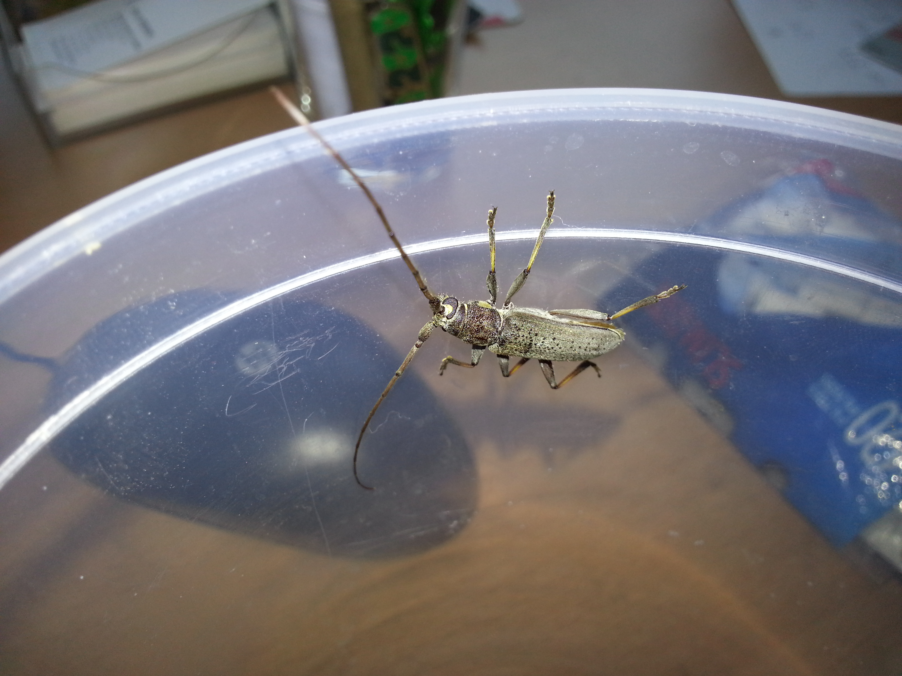
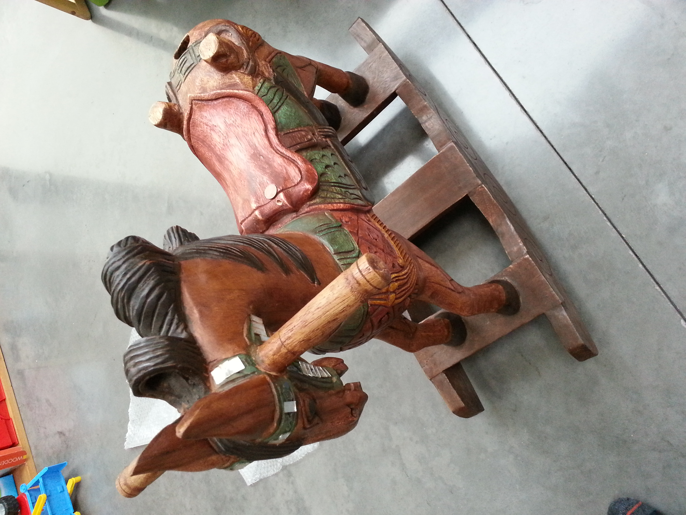
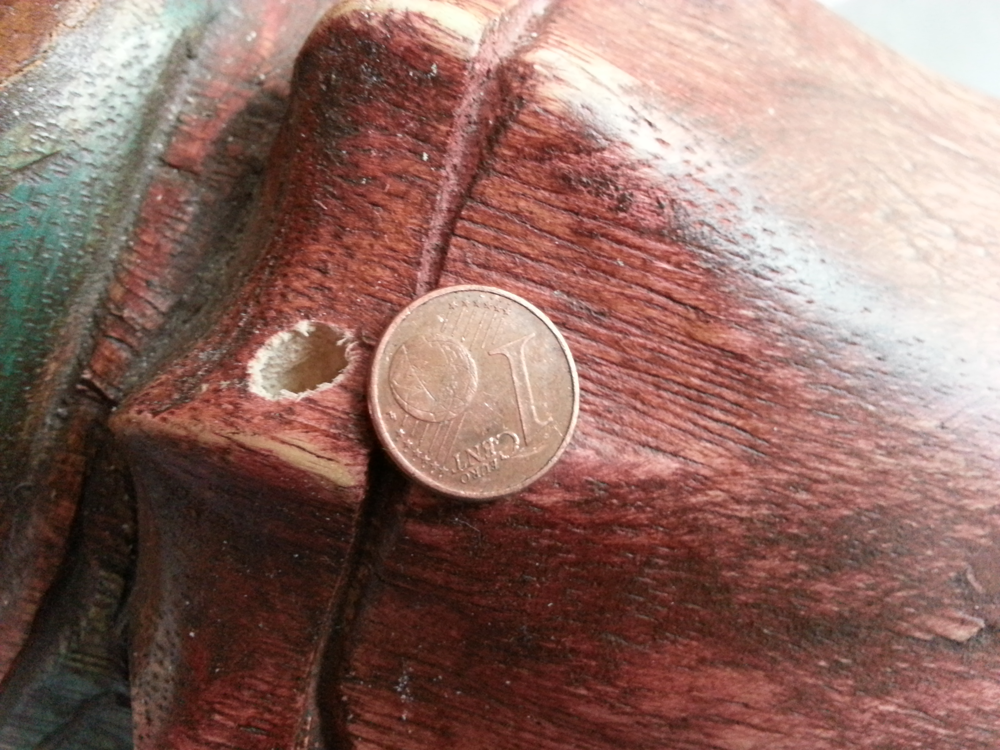

2013-08-19

**New interception record** : One *Stromatium longicorne* specimen was discovered in august 2013 in the living quarters of a house in Merelbeke, Ghent, Belgium. The specimen was found, probably just after metamorphosis (image 1) and was not capable to move at the time of discovery. 

*Image 1: The specimen, just after metamorphosis*

Hours later the beetle became very active, indicating the beetle was in good condition (image 2).

*Image 2: The specimen after one day*

The woodwork's in the house were thoroughly examined and wooden toys were looked upon intensively but the exit hole was not found. A recent re-examination of one toys, a wooden rocking horse, showed an exit hole which could fit *Stromatium longicorne* (image 3 & 4). The maximal length of the exit hole measures 9 mm and the maximal width measures 6 mm. A second individual was ,to date, never found.

*Image 3:suspected carrier of the *Stromatiom longicorne* larvae*

*Image 4: detail of the exit hole*

The house was recently renovated and wood used was *Quercus sp* and *Pseudotsuga sp*. The wooden toys were made in Germany and the rocking horse was bought in an antiquities store in Bruges (pers. comm).  It's noteworthy that earlier, in the same house a Cerambyx cerdo ref was discovered.

The specimen was brought to the Royal Belgian Institute of Natural Sciences and added to the collection of the saproxylic beetles (image 5).  

*Image 5: The Stromatium longicore was preserved and added to the collection (RBINS:NR ID)